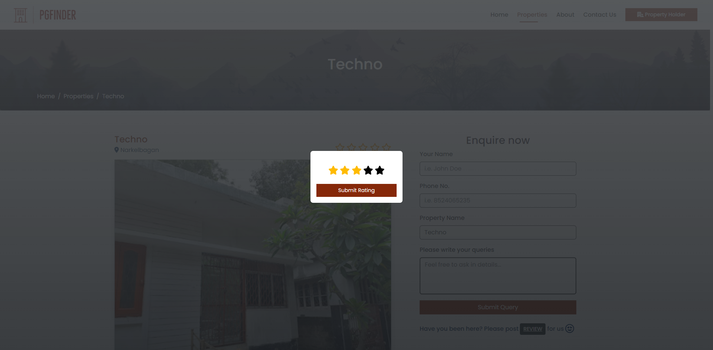

# PGFinder

PGFinder is an online web application for finding Paying Guest accommodations for users like - students or professionals or an individual, who is intended to relocate to a new place. PG Finder aims to simplify the search for suitable PG options by providing a user-friendly interface and filter search functionalities.  It uses MySQL as the database backend.

## Features

1. Users can search for PG accommodations based on location, gender and budget filter options. 
2. Property can create account, manage their property listings, receive enquiries and communicate with potential customer through the information received. 
3. Property owners can list their PG accommodations, providing detailed information such as room image, types, location, facilities, and rental terms, etc. 
4. The system also allows users to leave rating between (0 to 4) for the PG they are staying in. 
5. User can post their enquiry with their name, phone no and the enquiry info to the property holder. 
6. User can also visit the property by the Google map location link.

## Screenshots

### HOME PAGE

### Property Listing with Property Filters

### Property Details

### User Star Rating

### About Us

### Contact Us

### Property Holder Registration and Login

### Property Holder Registration and Login

